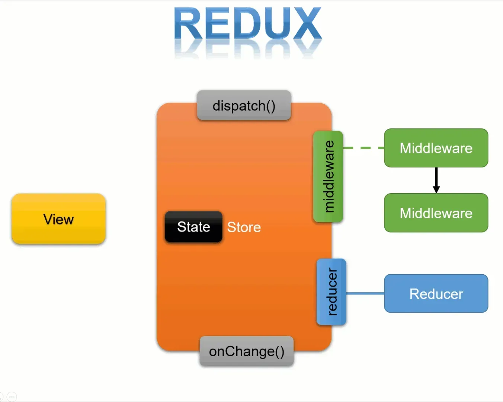

## state 종류

- Local state: 각각의 컴포넌트가 소유하고 있는 상태, 해당 컴포넌트 내에서만 관리되고 사용됨
- Cross-Component State: 두 개 이상의 컴포넌트 간에 공유되는 상태, props를 통해 상태 전달
- App-Wide State: 애플리케이션의 전체 영역에서 사용되는 상태, 여러 컴포넌트 또는 앱의 전체 영역에서 공유되어야 하는 데이터나 상태에 사용
  <br/>

## redux

- JS 상태관리 라이브러리
- 꼭 리액트에 종속되는 개념은 아님
- 사용 이유: props drilling 방지
  <br/>

## redux 흐름

### redux 용어 정리

#### Store

- 상태가 관리되는 오직 하나의 공간
- 안에는 현재 애플리케이션 상태와 리듀서가 들어있음
- **한 개의 프로젝트는 단 하나의 스토어만 가질 수 있음**
- **스토어에 있는 데이터는 컴포넌트에서 직접 조작하지 않음 ➡️ 리듀서 함수 사용**

#### action

- 상태에 어떤 변화가 필요하면 action 발생
- 컴포넌트에서 store에 운반할 데이터
- 하나의 객체로 표현
- 리듀서가 수행할 작업을 설명

```javascript
{
  type: "CHANGE_INPUT",
  text: "안녕하세요"
}
```

#### dispatch

- 액션을 발생시키는 것
- `dispatch(action)` 형태로 액션 객체를 파라미터로 넣어서 호출

#### reducer

- 액션의 type에 따라 변화를 일으키는 함수
- `reducer(state, action){}`
- 항상 새로운 상태 객체를 반환

```jsx
const initialState = {
  counter: 1
}

function reducer(state=initialState, action){
  switch(action.type){
    case "INCREMENT":
      return{
        counter: state.counter + 1;
      }
    default:
      return state;
  }
}
```

### redux의 흐름



1. View 에서 액션이 일어난다.
2. dispatch 에서 action이 일어나게 된다.
3. action에 의한 reducer 함수가 실행되기 전에 middleware가 작동한다.
4. middleware 에서 명령내린 일을 수행하고 난뒤, reducer 함수를 실행한다.
5. reducer 의 실행결과 store에 새로운 값을 저장한다.
6. store의 state에 subscribe 하고 있던 UI에 변경된 값을 준다.

<br/>

## redux 예제

```js
// configStore.js
import { createStore, combineReducers } from "redux";
import counter from "../modules/counter";

const rootReducer = combineReducers({
  counter: counter,
});
const store = createStore(rootReducer);

export default store;

// 1. createStore(): 리덕스의 가장 핵심이 되는 스토어를 만드는 메소드
// 리덕스는 단일 스토어로 모든 상태 트리를 관리 ➡ 리덕스를 사용할 시 createStore() 함수는 한 번만 호출

// 2. combineReducers()
// 리덕스는 action -> dispatch -> reducer 순으로 동작
// 이때 어플리케이션이 복잡해지게 되면 reducer 부분을 여러 개로 나눠야 하는 경우가 발생
// combineReducer()는 여러 개의 독립적인 reducer의 반환 값을 하나의 상태 객체로 만들어줌
```

```js
// /modules/counter.js
// module: state의 그룹

// 초기 값
const initialState = {
  number: 0, // const [number, setNumber] = useState(0)과 동일
};

// 1. 컴포넌트로부터 dispatch를 통해 액션 객체를 전달 받음
// 2. action안에 있는 type을 스위치문을 통해 하나씩 검사해서, 일치하는 case 찾기
// 3. type과 일치하는 case에서, 해당 코드가 실행되고 새로운 state를 return
// 4. 리듀서가 새로운 state를 반환하면, 그게 새로운 모듈의 state로 바뀜

// reducer: 변화를 일으키는 함수
const counter = (state = initialState, action) => {
  console.log(action);
  switch (action.type) {
    case "PLUS_ONE":
      return {
        number: state.number + 1,
      };
    case "MINUS_ONE":
      return {
        number: state.number - 1,
      };
    default:
      return state;
  }
};

export default counter;
```

```jsx
// App.jsx

import { useDispatch, useSelector } from "react-redux";
import "./App.css";

function App() {
  // useSelector
  // react-redux에서 제공하는 useSelector hook
  const numberStore = useSelector((state) => state);
  const number = useSelector((state) => state.counter.number);

  // 디스패치 생성
  const dispatch = useDispatch();
  return (
    <div className="App">
      <button
        onClick={() => {
          dispatch({ type: "MINUS_ONE" });
        }}
      >
        -1
      </button>
      {number}
      <button
        onClick={() => {
          dispatch({ type: "PLUS_ONE" });
        }}
      >
        +1
      </button>
    </div>
  );
}

export default App;
```

## RTK(redux toolkit)

- redux의 복잡성을 줄이기 위해 만들어진 도구
- 액션 생성, 리듀서, 미들웨어 등 redux와 관련된 기능들을 효율적으로 구현

### `createSlice()`

- 리듀서와 액션을 함께 생성하는 함수
- 슬라이스라는 개념을 사용하여 액션 타입, 액션 생성 함수, 리듀서를 한 번에 정의

```jsx
const counterSlice = createSlice({
  name: "counter",
  initialState: initialCounterState,
  reducers: {
    increment(state) {
      state.counter++;
    },
    decrement(state) {
      state.counter--;
    },
    increase(state, action) {
      state.counter = state.counter + action.payload;
    },
  },
});
```

### `configureStore()`

- redux 스토어를 생성하기 위한 함수
- 여러 미들웨어와 리듀서를 쉽게 통합할 수 있으며, Redux DevTools 확장 프로그램과의 통합도 제공

```jsx
const store = configureStore({
  reducer: { counter: coutnerSlice.reducer, auth: authSlice.reducer },
});

export const counterActions = counterSlice.actions;
export const authActions = authSlice.actions;

export default store;
```

<br/>

## Ducks 패턴

- 액션 타입, 액션 생성자, 리듀서 파일을 역할 단위로 각각 분리하지 않고,
- 하나의 도메인 (e.g. user, todos 등)에 대한 모든 Redux 관련 로직을 하나의 파일로 통합하여 작성 ➡️ 유지보수성과 가독성 향상

### 예제

#### 예제 파일 구조

```css
src/
├── store/
│   ├── index.js        ← Redux 스토어 설정
│   ├── user.js         ← user 도메인 Ducks
│   └── todos.js        ← todos 도메인 Ducks
├── components/
│   └── ...
├── App.js
└── index.js
```

#### Ducks 파일 예시 (user.js)

```javascript
// user.js

// 1️⃣ 액션 타입 정의
const SET_USER = "user/SET_USER";
const CLEAR_USER = "user/CLEAR_USER";

// 2️⃣ 액션 생성자
export const setUser = (user) => ({
  type: SET_USER,
  payload: user,
});

export const clearUser = () => ({
  type: CLEAR_USER,
});

// 3️⃣ 초기 상태
const initialState = {
  userInfo: null,
};

// 4️⃣ 리듀서
export default function userReducer(state = initialState, action) {
  switch (action.type) {
    case SET_USER:
      return { ...state, userInfo: action.payload };
    case CLEAR_USER:
      return { ...state, userInfo: null };
    default:
      return state;
  }
}

// 5️⃣ 선택자 (옵션)
export const selectUser = (state) => state.user.userInfo;
```

#### 스토어 설정 예시 (store/index.js)

```javascript
import { combineReducers, createStore } from "redux";
import user from "./user";
import todos from "./todos";

const rootReducer = combineReducers({
  user,
  todos,
});

const store = createStore(rootReducer);

export default store;
```
